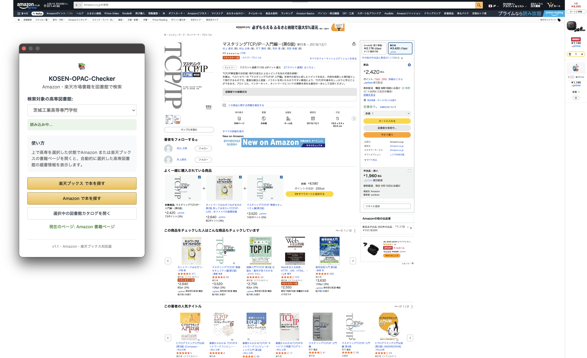
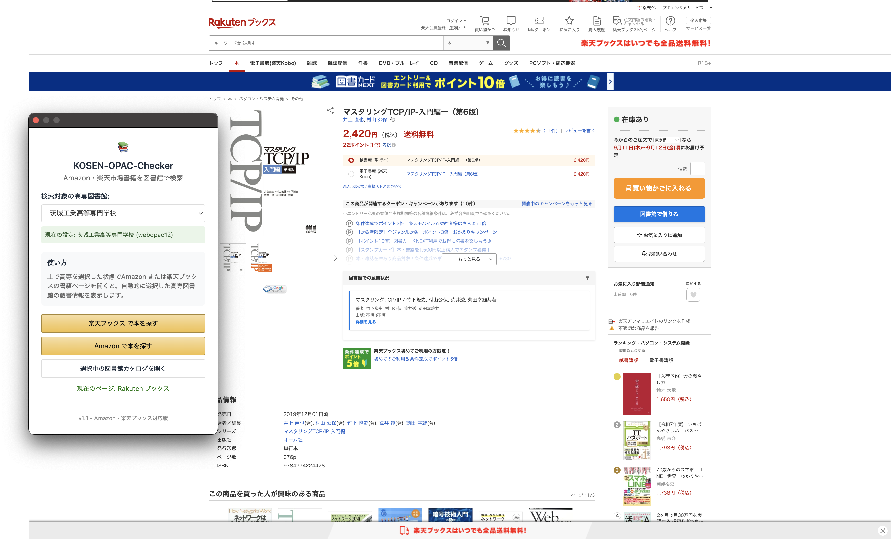

# KOSEN-OPAC-Checker


Amazon・楽天ブックスの書籍ページに全国の高専図書館の蔵書情報を自動的に表示する Chrome 拡張機能です。

<div style="display: flex; gap: 10px;">
   
   
</div>

## 機能

- **自動検索**: Amazon・楽天ブックスの書籍ページを開くと、自動的に図書館の蔵書を検索
- **全国高専対応**: 全国 51 校の高専図書館から選択可能（函館高専〜沖縄高専）
- **高専選択機能**: ポップアップから簡単に検索対象の高専を変更可能
- **ISBN 検索**: 正確な書籍情報で検索（ISBN-13/ISBN-10 対応）
- **マルチサイト対応**: Amazon と楽天ブックスの両方で使用可能
- **自然な UI**: 各サイトのデザインに合わせたネイティブなボタンデザイン
- **最適配置**: 購入ボタンエリアに自然に配置
- **詳細情報表示**: 図書館の蔵書詳細情報を表示
- **ワンクリックアクセス**: 図書館の詳細ページに直接リンク
- **フォールバック検索**: ISBN 検索で見つからない場合、タイトル検索を自動実行

## デザインの特徴

### Amazon 対応

- Amazon 公式スタイルの完全再現
- 「今すぐ買う」ボタンと同様のデザイン
- 購入ボタンエリアに自然に統合
- Amazon 公式 CSS の動的読み込みでネイティブな見た目を実現

### 楽天ブックス対応

- 楽天市場のデザインガイドラインに準拠
- 購入ボタンエリアに自然に配置
- 楽天風のスタイリングとカラーリング

### 高専選択機能

- 51 校の高専図書館から選択可能
- ポップアップ UI で簡単に切り替え
- 選択した高専の情報を永続化（Chrome ストレージ API）

## インストール方法

### 開発版（手動インストール）

1. このプロジェクトをクローンまたはリリースからダウンロード
2. Chrome を開く
3. `chrome://extensions/` にアクセス
4. 右上の「デベロッパーモード」を有効にする
5. 「パッケージ化されていない拡張機能を読み込む」をクリック
6. `Library` フォルダを選択（プロジェクトのルートディレクトリ）

### リリース版（推奨）

1. `KOSEN-OPAC-Checker-x.x.zip` をダウンロード
2. ダウンロードしたファイルを解凍
3. Chrome を開き、`chrome://extensions/` にアクセス
4. 右上の「デベロッパーモード」を有効にする
5. 「パッケージ化されていない拡張機能を読み込む」をクリック
6. 解凍したフォルダを選択してインストール完了

## 使用方法

### 初期設定

1. 拡張機能アイコンをクリックしてポップアップを開く
2. 「検索対象の高専図書館」から自分の高専を選択
3. 設定は自動的に保存

### Amazon での使用

1. Amazon.co.jp の書籍ページにアクセス
2. ページが読み込まれると、自動的に選択した高専図書館の蔵書を検索
3. 購入ボタンエリアに図書館ボタンが表示

### 楽天ブックスでの使用

1. books.rakuten.co.jp の書籍ページにアクセス
2. ページが読み込まれると、自動的に選択した高専図書館の蔵書を検索
3. 購入ボタンエリアに図書館ボタンが表示

### ボタンの種類

- **図書館で借りる（青色）**: 蔵書がある場合
- **図書館にはありません（グレー）**: 蔵書がない場合

### 高専の変更

- 拡張機能アイコンをクリック
- ドロップダウンメニューから別の高専を選択
- 現在開いているページで自動的に再検索が実行されます

## 対応サイト・システム

### 対応書籍サイト

- **Amazon.co.jp**: 書籍ページ（ISBN 自動抽出対応）
- **楽天ブックス**: books.rakuten.co.jp の書籍ページ

### 対応図書館システム

- **高専統合 WebOPAC**: libopac-c.kosen-k.go.jp
- **対応高専**: 全国 51 校（函館高専〜沖縄高専）

### 支援されている高専（一部）

- 函館工業高等専門学校
- 苫小牧工業高等専門学校
- 茨城工業高等専門学校（デフォルト）
- 東京工業高等専門学校
- 沼津工業高等専門学校
- 明石工業高等専門学校
- 熊本高等専門学校
- 沖縄工業高等専門学校
- など全 51 校

## 技術仕様

### ファイル構成

```text
KOSEN-OPAC-Checker/
├── manifest.json          # 拡張機能の設定（Manifest V3）
├── content.js             # Amazon ページに注入されるスクリプト
├── content-rakuten.js     # 楽天ブックスページ用スクリプト
├── background.js          # バックグラウンドでの検索処理（Service Worker）
├── popup.html             # 拡張機能ポップアップ UI
├── popup.js               # ポップアップ操作用スクリプト
├── icons/                 # アイコンファイル
│   ├── icon16.png
│   ├── icon32.png
│   ├── icon48.png
│   ├── icon128.png
│   └── icon1024.png
└── working_scraper.js     # 元のスクレイピングスクリプト（参考用）
```

### Chrome 拡張機能の仕様

- **Manifest Version**: 3（最新仕様）
- **Permissions**: `activeTab`, `storage`
- **Host Permissions**: Amazon、楽天ブックス、高専図書館システム
- **Content Scripts**: サイトごとに分離（Amazon/楽天ブックス）
- **Service Worker**: バックグラウンド検索処理
- **Storage API**: 高専選択設定の永続化

### 検索ロジック（フォールバック戦略）

1. **ISBN 検索（最優先）**:

   - ISBN-13 を抽出
   - 高専統合 WebOPAC の詳細検索 を使用
   - 最も正確な検索方法

2. **タイトル全文検索（フォールバック 1）**:

   - ISBN 検索で見つからない場合
   - 書籍タイトルをそのまま使用
   - サイト固有の文言のみ除去

3. **メインタイトル+著者検索（フォールバック 2）**:

   - タイトル全文検索で見つからない場合
   - タイトルの最初の区切り文字まで + 主著者名
   - より精密な検索クエリ

4. **段階的精度調整**:
   - 各段階で検索精度を調整
   - 検索結果が 0 件の場合、次の戦略に移行
   - 全戦略失敗時は「見つからない」と判定

### UI 表示

#### Amazon

- 購入ボタンエリア（「今すぐ買う」「カートに入れる」ボタン周辺）に配置
- Amazon 公式 CSS の動的読み込みでネイティブスタイル実現
- `a-button` クラスの完全再現

#### 楽天ブックス

- 購入ボタンエリア（「買い物かごに入れる」ボタン周辺）に配置
- 楽天デザインガイドラインに準拠したスタイリング
- カートボタン後の自然な配置

### 高専管理システム

- 51 校の高専 ID 管理（01: 函館高専 〜 55: 沖縄高専）
- Chrome Storage Sync API による設定同期
- ポップアップ UI での動的切り替え

## UI デザイン

### Amazon ネイティブスタイル

- Amazon 公式 CSS の完全統合
- `a-button`クラスの正確な再現
- グラデーション、ボーダー、シャドウの完全一致
- フォント（Amazon Ember）の使用

### レスポンシブ対応

- モバイル・タブレット・デスクトップ対応
- Amazon の既存 UI に完全に適合
- スクロールバーやコンテナサイズも Amazon に準拠

## 設定とカスタマイズ

### 高専図書館の変更

1. 拡張機能アイコンをクリック
2. ドロップダウンメニューから対象の高専を選択
3. 設定は自動的に保存され、全デバイスで同期されます

## トラブルシューティング

### 拡張機能が表示されない

1. Amazon または楽天ブックスの書籍ページかどうか確認
2. デベロッパーツールでエラーがないか確認
3. 拡張機能が有効になっているか確認
4. Manifest V3 対応ブラウザかどうか確認

### 検索結果が表示されない

1. 選択した高専が正しいか確認
2. ISBN が正しく抽出されているか確認
3. 高専図書館システムがアクセス可能か確認
4. CORS エラーがないか確認

### 高専選択が保存されない

1. Chrome ストレージ API が有効か確認
2. 拡張機能の権限設定を確認
3. ブラウザの同期設定を確認

### ボタンのスタイルが正しくない

1. サイト固有の CSS が正しく読み込まれているか確認
2. 他の拡張機能との競合がないか確認
3. ブラウザキャッシュをクリアして再試行

## 開発

### 元のスクリプトとの関係

この拡張機能は `working_scraper.js` の機能をベースに作成されています：

- 同一の検索ロジック
- 同一の HTML 解析処理
- Chrome 拡張機能として再実装
- Manifest V3 仕様への対応

### 主な改善点

1. **全国高専対応**: 51 校の高専図書館から選択可能
2. **楽天ブックス対応**: Amazon に加えて楽天ブックスもサポート
3. **ポップアップ UI**: 直感的な高専選択インターフェース
4. **設定永続化**: Chrome Storage API による設定同期
5. **Manifest V3**: 最新の Chrome 拡張機能仕様に対応
6. **マルチコンテンツスクリプト**: サイトごとに最適化された処理
7. **Service Worker**: バックグラウンド処理の効率化

### 技術的特徴

- **Content Scripts 分離**: Amazon 用と Rakuten 用でファイルを分離
- **Storage API**: 高専選択設定の同期とローカル保存
- **Service Worker**: Manifest V3 対応のバックグラウンド処理
- **フォールバック検索**: ISBN→ タイトル → 著者名の段階的検索
- **Cross-Origin 対応**: 適切な host_permissions 設定

## ライセンス

MIT License - 自由に使用・改変・配布が可能です。

---

**注意**: この拡張機能は教育・研究目的で作成されています。Amazon・楽天ブックス・高専図書館システムの利用規約を遵守してご利用ください。各サイトへの過度なアクセスは控え、適切な間隔でのアクセスを心がけてください。
